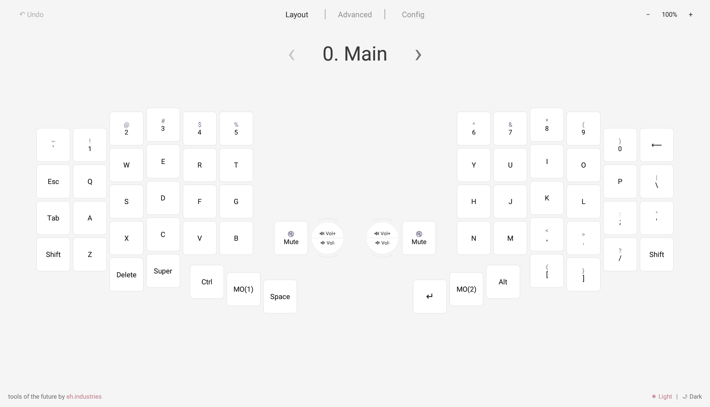
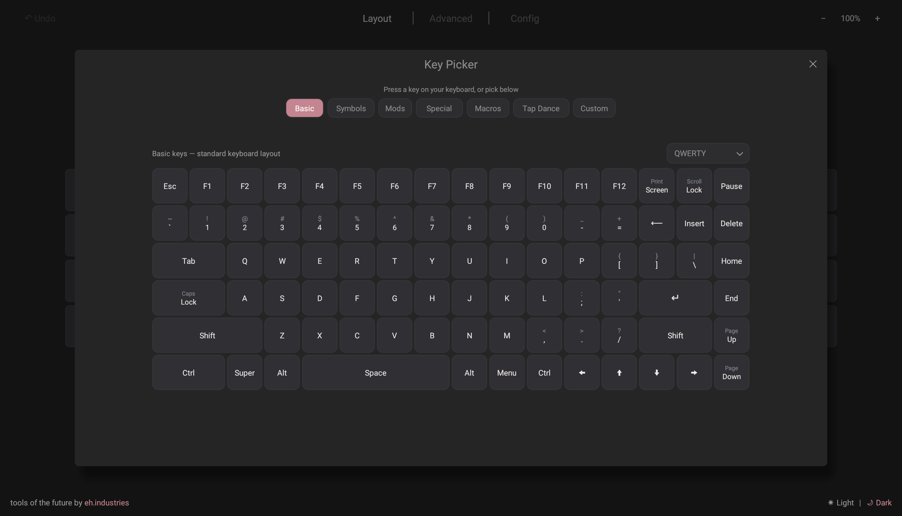
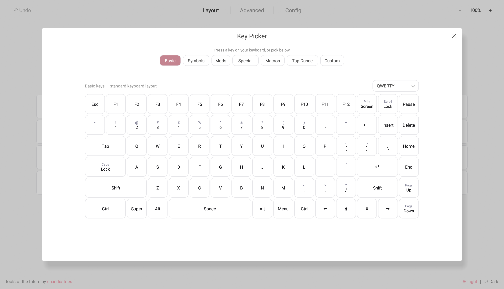
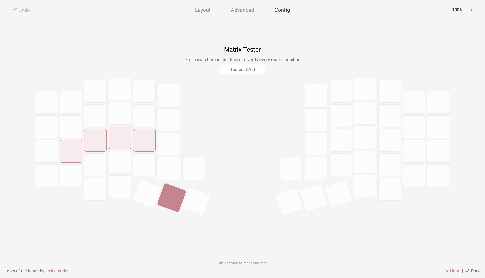
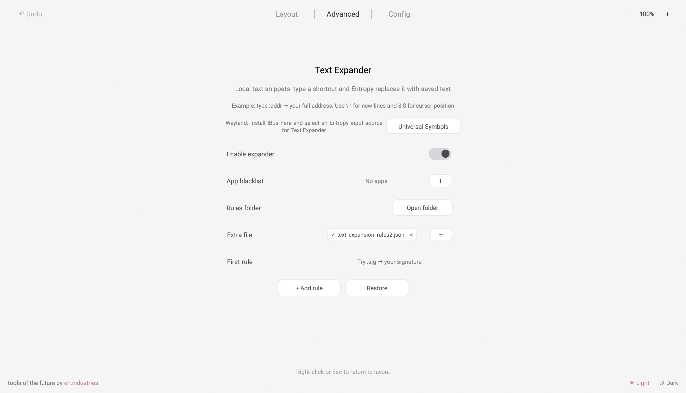

# Entropy

Modern app for programmable keyboards and input devices, built by Ergohaven.

[](LICENSE)
[](https://github.com/ergohaven/entropy/releases)
[](#platforms)
[](#compatibility)



Entropy is a desktop app with a modern, minimalist, and intuitive interface for
configuring programmable input devices running Vial-QMK or Vial-RMK firmware:
split keyboards, macropads, trackballs, touchpad modules, and other hardware
that exposes keyboard-style firmware features through HID.

It is designed to feel direct and predictable: connect a device, pick it from the
device list, and work through layout, keycodes, macros, lighting, pointing controls,
and firmware settings from one coherent interface.

## Screenshots

<p align="center">
  
  
  
  
</p>

## Main Features

- Modern, minimalist, intuitive design for complex device configuration
- Complete Vial workflow: layouts, keycodes, macros, combos, tap dance,
  key overrides, RGB, pointing controls, and firmware settings
- Support for keyboards, macropads, trackballs, touchpads, encoders, displays,
  and modular input devices
- Text Expander for local shortcuts from programmable devices
- Universal Symbols for typography, arrows, math, currency, and custom characters
- Fast keycode picker with layouts, symbols, modifiers, macros, and smart filtering
- Custom names for layers, combos, macros, tap dance entries, and other device objects
- Live Features as a built-in qmk-hid-host replacement for firmware host data
- Matrix Tester and Layout Indicator for testing and daily layer visibility
- Layer hover preview, encoder controls, custom labels, and multilingual legends
- Advanced pages for Auto Shift, Mouse Keys, Tap-Hold, One Shot, Grave Escape,
  Magic, Layer LEDs, touchpad settings, and modules
- Light/dark themes, accent color, UI scaling, settings import/export, and tray mode
- Linux udev helper plus optional IBus/Fcitx5 integrations for Wayland input workflows

## Platforms

| Platform | Status | Package |
| --- | --- | --- |
| Linux x86_64 | Primary beta target | AppImage |
| Windows x86_64 | Beta target | Portable ZIP |
| macOS | Source/build-script available | App bundle script |

Public beta builds focus on Linux and Windows first. macOS packaging exists in the
repository for source builds.

## Downloads

Beta builds are published on the
[GitHub Releases](https://github.com/ergohaven/entropy/releases) page:

- `entropy-0.1.0-beta.1-linux-x86_64.AppImage`
- `entropy-0.1.0-beta.1-windows-x86_64.zip`
- `SHA256SUMS.txt`

Windows builds are unsigned during beta, so Windows SmartScreen may warn before
launching the app.

## Quick Start

1. Download the build for your platform from GitHub Releases
2. Connect a Vial-compatible device
3. On Linux, install Vial udev rules if Entropy cannot open the device
4. Launch Entropy
5. Select the device from the top-left device dropdown
6. Edit layers, keycodes, advanced firmware features, or app settings
7. Save/write changes when the edited feature requires it

## Linux Device Access

Vial devices use hidraw access on Linux. If your device appears but cannot be opened,
install the included udev rule:

```sh
./linux/udev/install-vial-rules.sh
```

Replug the device after installing the rule.

## Compatibility

Entropy currently communicates with Vial-compatible HID devices. Its UI is designed
for programmable keyboards and adjacent input devices such as macropads, trackballs,
touchpads, and encoder/display modules when those features are exposed by firmware.

Best-tested hardware is Ergohaven hardware and Vial-compatible QMK/RMK-style devices.
Firmware support varies by device; Entropy hides firmware-gated pages when the
connected device does not expose the required capability.

Not in scope for this beta:

- Browser-only configuration
- Mobile platforms

## Development

Install a stable Rust toolchain, then build the desktop app:

```sh
cargo run
cargo build --release
```

Linux builds require native GUI/HID dependencies. On Debian/Ubuntu-like systems:

```sh
sudo apt-get install \
  libhidapi-dev \
  libudev-dev \
  libxcb-render0-dev \
  libxcb-shape0-dev \
  libxcb-xfixes0-dev \
  libxkbcommon-dev \
  libssl-dev \
  libgtk-3-dev
```

Build a macOS app bundle on macOS:

```sh
scripts/build_macos_app.sh
```

Build a Windows release binary from Linux with the GNU target:

```sh
cargo build --release --target x86_64-pc-windows-gnu
```

## Changelog

- [CHANGELOG.md](CHANGELOG.md)

## License

Entropy is licensed under GPL-3.0-or-later. See [LICENSE](LICENSE).
